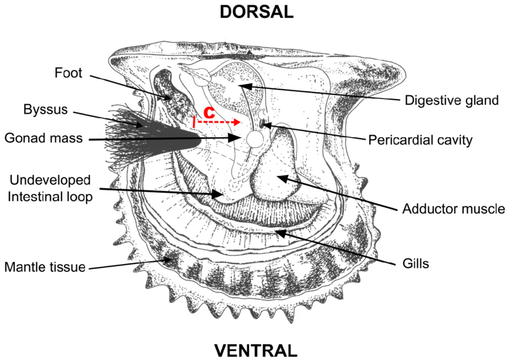

# Aquaculture Suitability Analysis for West Coast Exclusive Economic Zones
*This repository was produced as a part of the UCSB MEDS program for EDS 223: Geospatial Analysis & Remote Sensing.*

## About
As global demand for sustainable protein grows, marine aquaculture offers an alternative to land-based meat production. [Gentry et al.](https://www.nature.com/articles/s41559-017-0257-9) found through mapping potential for marine aquaculture using multiple constraints, that global seafood demand could be met using less than 0.015% of global ocean area.

This exercise determines which Exclusive Economic Zones (EEZ) on the West Coast of the US are best suited to developing marine aquaculture to several species of oysters, and develops a function for visualizing suitability based on a single species—*Pteria sterna*, the Pacific winged oyster—in this case. This function is generalizable to other species of interest, given the arguments:

- minimum and maximum sea surface temperature
- minimum and maximum depth
- species name

This exercise involves:

- combining vector/raster data
- resampling raster data
- masking raster data
- map algebra
- custom R function


*Pteria Sterna Anatomy by Héctor Acosta-Salmón*

## Repository Structure
```
aquaculture-suitability
│   README.md
|   suitable-aquaculture.qmd
|   suitable-aquaculture.html
|   .gitignore
└───data
    │   wc_regions_clean.shp
    │   depth.tif
    │   average_annual_sst_2008.tif
    │   average_annual_sst_2009.tif
    │   average_annual_sst_2010.tif
    │   average_annual_sst_2011.tif
    │   average_annual_sst_2012.tif
    └───states
    │   cb_2023_us_state_20m.shp
└───images
    │   pteria-sterna-anatomy.jpg
```
## References/Acknowledgments
Data was provided as part of this [exercise](https://eds-223-geospatial.github.io/assignments/HW4.html), which was produced as a part of the Master of Environmental Data Science Program from the Bren School of Environmental Science and Management, taught by [Dr. Ruth Oliver](https://bren.ucsb.edu/people/ruth-oliver).

| Data                    | Citation                                                                                                                     | Link                                                                                    |
|------------------------|------------------------|------------------------|
| Sea Surface Temperature | NOAA Coral Reef Watch (2018). NOAA Coral Reef Watch Daily Global 5-km Satellite Sea Surface Temperature Anomaly Product v3.1 | <https://coralreefwatch.noaa.gov/product/5km/index_5km_ssta.php>                        |
| Bathymetry              | GEBCO Compilation Group (2022) GEBCO_2022 Grid (doi:10.5285/e0f0bb80-ab44-2739-e053-6c86abc0289c)                            | <https://www.gebco.net/data_and_products/gridded_bathymetry_data/#area>                 |
| EEZ Boundaries          | Marine Regions - Maritime Boundaries and Exclusive Economic Zones, 2019                                                      | <https://www.marineregions.org/eez.php>                                                 |
| State Boundaries        | U.S. Census Bureau TIGER/Line Shapefiles, 2023                                                                               | <https://www.census.gov/geographies/mapping-files/time-series/geo/tiger-line-file.html> |